[](https://github.com/cap10morgan/whalebridge/actions/workflows/ci.yml)
[](https://github.com/cap10morgan/whalebridge/releases/latest)
[](https://cap10morgan.github.io/whalebridge/)

# Whalebridge

A macOS menu bar app that lets Docker API clients (docker CLI, compose,
Testcontainers, IDEs) talk to Apple's native
[container](https://github.com/apple/container) runtime.

Whalebridge bundles and manages a [socktainer](https://github.com/socktainer/socktainer)
daemon — a Docker Engine API (v1.32–v1.51) translation layer over Apple's
Containerization stack — and takes care of everything around it: starting and
supervising the daemon, making sure Apple's container services are running,
and wiring up a Docker context so `docker ps` just works.

## Requirements

- macOS 26+ on Apple silicon
- [apple/container](https://github.com/apple/container/releases) 1.2.x installed
  (`container --version`)
- A Docker API client to point at it (e.g. `brew install docker`)

## Installation

Download the latest release from the [Releases page](https://github.com/cap10morgan/whalebridge/releases/latest), unzip it, and move **Whalebridge.app** into `/Applications`.

Whalebridge isn't notarized — that requires enrolling in the paid Apple
Developer Program, which this free, hobby project doesn't do — so Gatekeeper
blocks a downloaded copy's first launch as being from an "unidentified
developer." To get past that one-time block:

- **GUI**: try opening it normally first. If it's blocked, open **System
  Settings → Privacy & Security**, scroll down to the security message near
  the bottom (it names Whalebridge), and click **Open Anyway**. Confirm once
  more in the dialog that follows.
- **Terminal**: `xattr -cr /Applications/Whalebridge.app` clears the
  quarantine flag directly, skipping the Gatekeeper prompt entirely.

After that first launch, macOS remembers your choice — future updates (which
install automatically via Sparkle) won't prompt again.

## Architecture

<!--
Pre-rendered from assets/architecture.mmd instead of a live ```mermaid
fence: GitHub overlays every rendered Mermaid diagram with a permanent
pan/zoom/copy toolbar that has no opt-out, and for a diagram this size it
covers real content. Regenerate after editing the source:
  npx -y @mermaid-js/mermaid-cli -i assets/architecture.mmd -o assets/architecture-light.svg -t default -b transparent
  npx -y @mermaid-js/mermaid-cli -i assets/architecture.mmd -o assets/architecture-dark.svg -t dark -b transparent
-->
<picture>
  <source media="(prefers-color-scheme: dark)" srcset="assets/architecture-dark.svg">
  
</picture>

## Build

```sh
make bundle   # builds the daemon (vendor/socktainer) + app, assembles build/Whalebridge.app
make run      # bundle + launch
make dev      # run the app unbundled via swift run (uses the vendor daemon build)
```

## CI

`.github/workflows/ci.yml` runs on every push and pull request:

- **test** — builds the app package and runs `swift test`.
- **daemon** — builds the vendored socktainer daemon with the `patches/`
  series applied (so patch rot fails CI), then runs upstream's unit suite
  against the patched tree.
- **integration** — installs the pinned apple/container release, starts its
  services, and drives the patched daemon over the Docker API: `/_ping`,
  `/version` (verifying the platform-name patch), image pull progress
  streaming, and the `/containers/json` field contract the app's Containers
  menu decodes. GitHub's runners can't nest virtualization, so booting
  containers — and verifying the default-memory-limit patch, which only
  shows up in a running container's resource limits — stays a local-only
  check.

## Releasing

Releases are cut by CI (`.github/workflows/release.yml`): push a version tag
and the workflow builds the bundle, zips it, generates a Sparkle appcast, and
attaches both to a GitHub Release.

```sh
git tag v0.2.0 && git push origin v0.2.0
```

Updates are delivered with [Sparkle](https://sparkle-project.org). The app reads
`SUFeedURL` and `SUPublicEDKey` from its Info.plist, both baked in by
`scripts/bundle.sh` (override with the `APPCAST_URL` and `SUPUBLIC_ED_KEY` env
vars). The feed points at `releases/latest/download/appcast.xml`, which always
serves the appcast attached to the newest GitHub Release.

Repository secrets the release workflow uses:

- `SPARKLE_ED_PRIVATE_KEY` (required) — the EdDSA private key matching
  `SUPublicEDKey`; without a validly signed appcast, installed apps reject
  updates. Also keep an offline backup
  (`app/.build/artifacts/sparkle/Sparkle/bin/generate_keys -x whalebridge-eddsa.key`) —
  if the key is lost, existing installs can never accept another update.
- `MACOS_CERTIFICATE_P12` / `MACOS_CERTIFICATE_PASSWORD` (optional) — a
  base64-encoded Developer ID Application certificate export and its password.
  Without them the bundle is ad-hoc signed: Sparkle updates still verify via
  EdDSA, but Gatekeeper warns on first install.
- `APPLE_API_KEY_P8` / `APPLE_API_KEY_ID` / `APPLE_API_ISSUER` (optional) — an
  App Store Connect API key for `notarytool`; enables notarization + stapling.
  Requires the certificate secrets, since notarization needs the hardened
  runtime, which `bundle.sh` only enables when a signing identity is set.

## License

Apache License 2.0 — see [LICENSE](LICENSE). Bundled components are listed in
[NOTICE](NOTICE).

Docker is a registered trademark of Docker, Inc. Whalebridge is not affiliated
with or endorsed by Docker, Inc. or Apple Inc.
